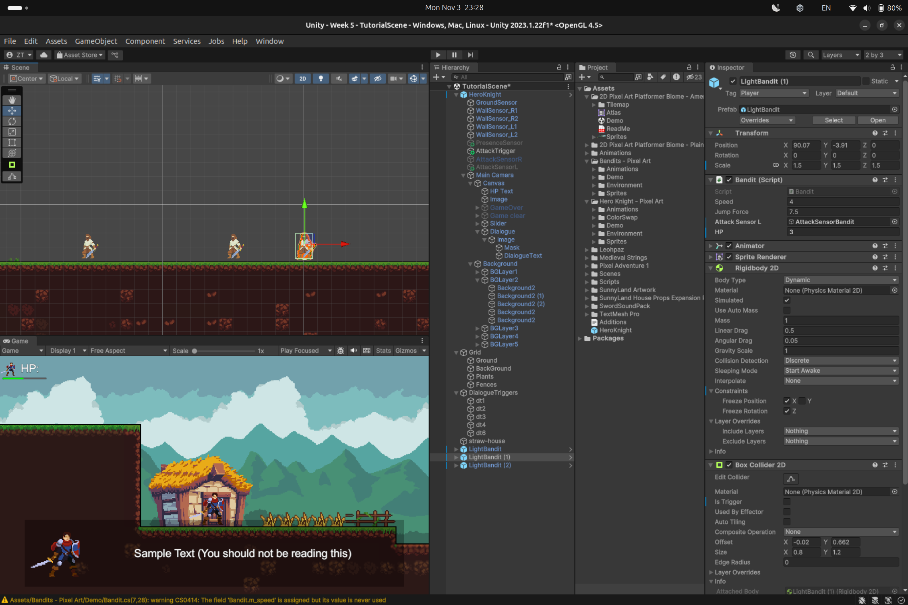

# Bandit Slayer

Created by Zolboo Tumendemberel - 24110177

## Goal of this Project
The goal of this game was to create a fun, playable 2D action platformer, while learning how to work with the Unity engine.

## Game story
You play as an adventuring knight, hired by a village to clean up a supposed bandit camp set up nearby. However, their attacks seem far stronger than most bandits, and you see glimpses of a strange, dark beings influencing them.

## Gameplay instruction
The tutorial is included in the game.

## Features of the game
- Parallax scrolling clamped down to the camera. Uses minimal amount of background objects to reduce load and work required to edit the background.
- Sound effects for attacks
- Background music
- Quick and responsive movement
- Double jump, rolling, dashing included
- Enemy attacks the player
- Persistent enemy model after death

## Conclusion

While a lot more features were planned, due to time constraints I was unable to implement them all. As it stands, the game itself it quite bare bones, without much enemy or level design to stand out. The project itself was used to explore the Unity engine, and as I wanted to create a game that looked and felt good to play from the beginning, too much time and effort went into the character controller, parallax scrolling, and animation smoothing efforts.
Due to not following a set tutorial, and mostly brute-forcing my way into the unity engine systems and code, the project unfortunately had to be refactored multiple times throughout development, eating away from the time. Yet, it still is not as optimal/cleanly coded as I would like. The collision system inheriting everything and triggering multiple instances, for example, is a bug that needs to be fixed in future development.

Overall, many lessons were learned from this project, including how z axis in 2D unity engine functions to assist in layers (this was used to implement the Parallax scrolling) how to use collision boxes for entity detection, event triggers, and action triggers (for dialogue and combat), how to use the sound engine to play sound effects and music, etc.

## Assets used
- Sound effects: [RPG Essentials Sound Effects](https://assetstore.unity.com/packages/audio/sound-fx/rpg-essentials-sound-effects-free-227708)
- Background music: [Medieval Strings](https://assetstore.unity.com/packages/audio/music/medieval-strings-270863)
- House texture: [SunnyLand House Props](https://assetstore.unity.com/packages/2d/textures-materials/building/sunnyland-house-props-expansion-pack-237700)
- Environment: [2D Pixel Art Platformer | Biome - Plains](https://assetstore.unity.com/packages/2d/environments/2d-pixel-art-platformer-biome-plains-255002)
- Enemy: [Bandits - Pixel Art](https://assetstore.unity.com/packages/2d/characters/bandits-pixel-art-104130)
- Main Character: [Hero Knight - Pixel Art](https://assetstore.unity.com/packages/2d/characters/hero-knight-pixel-art-165188)